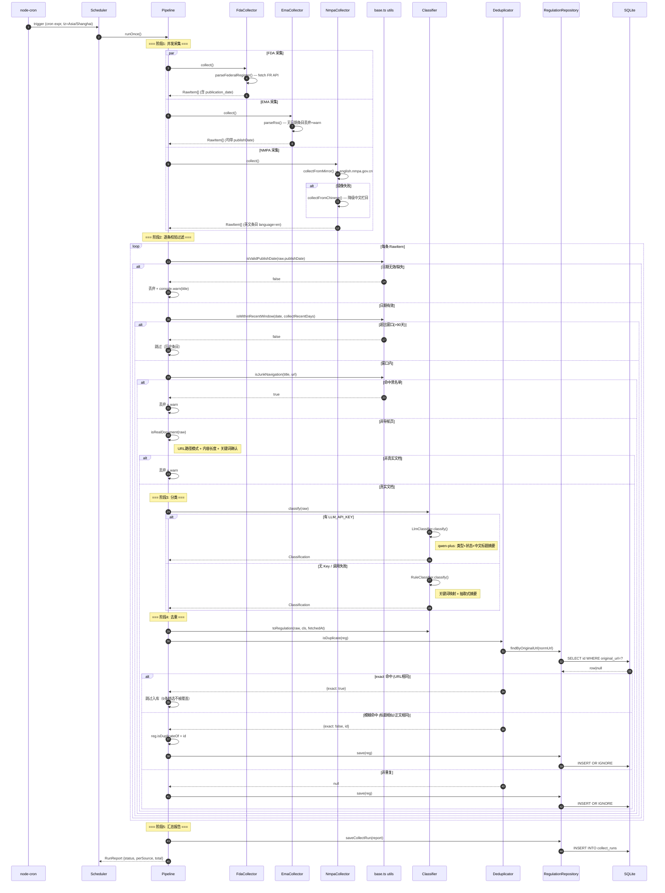
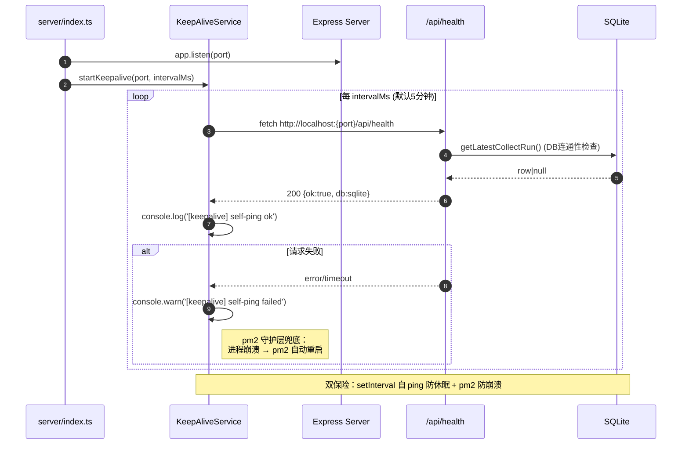
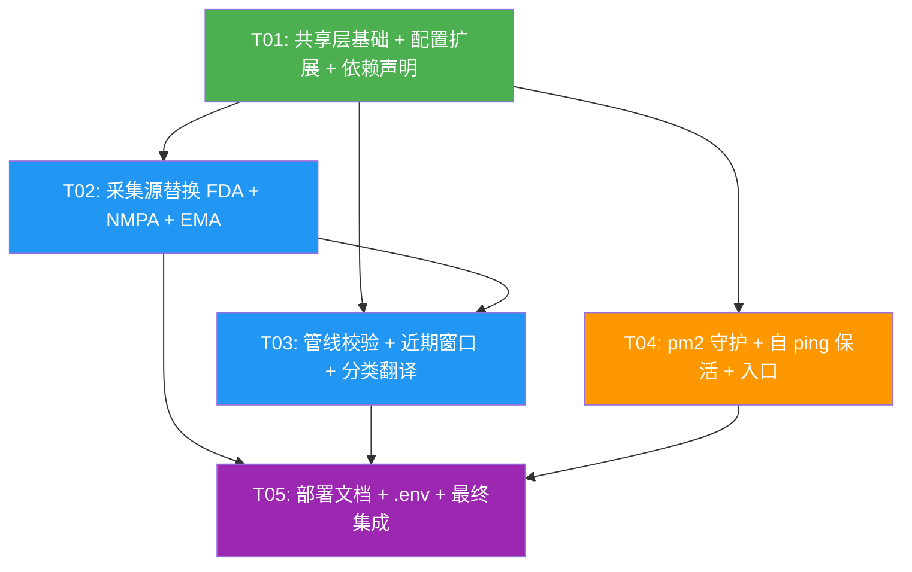

# 法规情报追踪系统 · 增量架构设计（采集加固 + qwen 分类验证 + 稳定常驻）

> 架构师：高见远｜基于 `PRD_reggov_tracker_increment_latest_stable.md` 与主理人 7 项决策
> 原则：最小变更、不改类型 Schema、不动前端视觉、不覆盖 9 条精选数据

---

## Part A: System Design

### 1. Implementation Approach

#### 1.1 核心技术挑战与对策

| 挑战 | 现状根因 | 本轮对策 |
|------|---------|---------|
| FDA 栏目页污染 | `parseOcp()` 用 cheerio 抓 OCP 落地页所有 `<a>` 链接，导航/栏目页无 publishDate 混入 | **移除 parseOcp()**，改用 Federal Register API（结构化 `publication_date`）为主 + FDA Guidance RSS 为辅 |
| NMPA WAF 拦截 | 中文原站（cde.org.cn / cmde.org.cn）对自动请求返回 403 | 主路径切换到 `english.nmpa.gov.cn` 英文镜像；中文栏目降级为可配置备选 |
| publishDate 校验分散 | 仅在 `fda.ts` 采集器内部检查，其他源无校验 | 提升到 `Pipeline` 管线层统一强校验 |
| 近期窗口缺失 | 无时间窗口过滤，历史回灌风险 | Pipeline 层增加 `COLLECT_RECENT_DAYS`（默认 90 天）过滤 |
| 黑名单局部化 | `JUNK_NAV_PATTERNS` 仅存于 `fda.ts`，其他源无法复用 | 提升到 `shared/constants.ts` 共享层并扩充 |
| Cloud Studio 休眠 | 免费版空闲可能休眠导致服务不可达 | 内置自 ping 保活（`setInterval` 定时调 `/api/health`）+ pm2 守护双保险 |

#### 1.2 框架与库选型

| 组件 | 选型 | 理由 |
|------|------|------|
| FDA 数据源 | **Federal Register API**（`https://www.federalregister.gov/api/v1/documents`） | 无需 Key、REST JSON、`publication_date` 结构化字段 100% 可靠、支持 agency+keyword+日期范围检索 |
| HTTP 客户端 | Node 18+ 内置 `fetch`（已有 `fetchText`） | 无需新增依赖，复用 `base.ts` 的 `fetchText` |
| RSS 解析 | `rss-parser`（已有） | FDA Guidance RSS / EMA RSS 复用现有解析 |
| HTML 解析 | `cheerio`（已有） | NMPA 英文镜像 HTML 抽取复用 |
| LLM 分类 | `openai` SDK（已有）+ qwen 兼容模式 | 已实现 json_object 模式 + 手动解析 + 规则回退 |
| 进程守护 | **pm2**（新增 devDependency） | 崩溃自动重启、日志管理、cron 调度能力 |
| 定时调度 | `node-cron`（已有） | 复用现有 Scheduler |
| 自 ping 保活 | `setInterval` + `fetch`（内置） | 零依赖、服务启动即生效 |

#### 1.3 架构模式

保持现有 **分层 MVC** 架构不变：
```
Routes (Controller) → Pipeline (Service) → Collectors/Classifier/Deduplicator (Domain) → Repository (DAO) → DbAdapter (Infrastructure)
```
本轮变更集中在 **Collectors 层**（数据源替换）和 **Pipeline 层**（校验前移），不改变整体分层。

---

### 2. File List（本轮新增/修改）

| # | 文件路径 | 操作 | 改动说明 |
|---|---------|------|---------|
| 1 | `shared/constants.ts` | 修改 | 新增 `JUNK_NAV_PATTERNS`（从 fda.ts 提升+扩充）；新增 `DEFAULT_NMPA_ENGLISH_COLUMNS`（英文镜像 URL）；新增 `FEDERAL_REGISTER_API` 配置常量；新增 `COLLECT_RECENT_DAYS_DEFAULT`；新增 `KEEPALIVE_INTERVAL_MS`；`ENV` 对象新增 `COLLECT_RECENT_DAYS`、`KEEPALIVE_ENABLED`、`KEEPALIVE_INTERVAL_MS` |
| 2 | `server/config.ts` | 修改 | `AppConfig` 新增 `collectRecentDays: number`、`keepaliveEnabled: boolean`、`keepaliveIntervalMs: number`；`loadConfig()` 读取对应环境变量 |
| 3 | `server/collectors/fda.ts` | 修改 | **移除 `parseOcp()` 及 OCP html 源**；新增 `parseFederalRegister()` 方法调用 Federal Register API；保留 `parseRss()` 作为辅源；`JUNK_NAV_PATTERNS` 改为从 `shared/constants.ts` 导入；`collect()` 中先调 API 再调 RSS |
| 4 | `server/collectors/nmpa.ts` | 修改 | 主路径改为英文镜像 `english.nmpa.gov.cn`；中文栏目作为 WAF 失败降级备选；英文镜像条目 `language` 设为 `'en'`；新增 `collectFromMirror()` + `collectFromChinese()` + 降级逻辑 |
| 5 | `server/collectors/ema.ts` | 修改 | `parseRss()` 中无 `publishDate` 的条目丢弃并 `console.warn`（与管线层校验形成双重保险） |
| 6 | `server/collectors/base.ts` | 修改 | 新增 `isValidPublishDate(date?: string): boolean` 工具函数；新增 `isWithinRecentWindow(date: string, days: number): boolean` 工具函数；新增 `isJunkNavigation(title: string, url: string): boolean` 使用共享黑名单 |
| 7 | `server/pipeline.ts` | 修改 | `runOnce()` 中在分类前增加：① publishDate 强校验（缺失/无效即丢弃+warn）② 近期窗口过滤 ③ 导航页黑名单过滤 ④ 真实文档校验（URL 路径模式+内容长度+关键词）；构造函数新增 `collectRecentDays` 参数 |
| 8 | `server/classifiers/llm.ts` | 修改 | 系统提示词增强：英文 NMPA 条目要求中文标题+摘要翻译；确保 qwen 路径对 `language='en'` 的 NMPA 条目产出中文 summary |
| 9 | `server/classifiers/index.ts` | 修改 | `RuleClassifier.classify()` 对 `language='en'` 的条目增加简易英文→中文关键词映射兜底翻译（无 LLM 时 NMPA 英文条目也有基本可读中文摘要） |
| 10 | `server/index.ts` | 修改 | `main()` 中实例化 Pipeline 时传入 `collectRecentDays`；启动后调用 `startKeepalive()` 自 ping 保活 |
| 11 | `server/keepalive.ts` | **新增** | `startKeepalive(port, intervalMs)` 函数：`setInterval` 定时 `fetch` 自身 `/api/health`，防 Cloud Studio 休眠 |
| 12 | `ecosystem.config.cjs` | **新增** | pm2 配置：进程名 `reggov-tracker`、`script: tsx server/index.ts`、`max_restarts: 10`、`restart_delay: 5000`、`min_uptime: 10s`、`autorestart: true` |
| 13 | `docs/DEPLOY.md` | 修改 | 完整重写为 Cloud Studio 稳定方案：工作区创建 → npm install → npm run build → 配 .env（含 `COLLECTION_ENABLED=true`）→ pm2 start → 端口预览公网 → 自 ping 保活说明 → 常用 pm2 命令 |
| 14 | `.env.example` | 修改 | 新增 `COLLECT_RECENT_DAYS=90`、`KEEPALIVE_ENABLED=true`、`KEEPALIVE_INTERVAL_MS=300000`；NMPA 说明更新（英文镜像为主） |
| 15 | `package.json` | 修改 | devDependencies 新增 `pm2` + `@types/node-cron`（修复 scheduler typecheck） |

---

### 3. Data Structures and Interfaces

```mermaid
classDiagram
    direction TB

    %% ===== 共享类型（不改字段，仅展示） =====
    class RawItem {
        +source: Source
        +sourceSub?: string
        +title: string
        +url: string
        +publishDate?: string
        +content?: string
        +language?: Language
    }

    class Classification {
        +type: RegType
        +status?: RegStatus
        +tags: string[]
        +summary: string
    }

    class Regulation {
        +id: string
        +title: string
        +source: Source
        +publishDate?: string
        +type: RegType
        +summary?: string
        +originalUrl: string
        +originalLanguage: Language
        +fetchedAt: string
    }

    %% ===== 采集器接口与实现 =====
    class Collector {
        <<interface>>
        +source: Source
        +collect() Promise~RawItem[]~
    }

    class FdaCollector {
        -feeds: SourceFeed[]
        -parser: Parser
        -cfg: AppConfig
        +collect() Promise~RawItem[]~
        +parseRss(xml, sourceSub) Promise~RawItem[]~
        +parseFederalRegister(json) RawItem[]
    }

    class EmaCollector {
        -feeds: SourceFeed[]
        -parser: Parser
        +collect() Promise~RawItem[]~
        +parseRss(xml, sourceSub) Promise~RawItem[]~
    }

    class NmpaCollector {
        -englishColumns: string[]
        -chineseColumns: string[]
        +collect() Promise~RawItem[]~
        -collectFromMirror() Promise~RawItem[]~
        -collectFromChinese() Promise~RawItem[]~
        +parseHtml(html, columnUrl, lang) RawItem[]
    }

    Collector <|.. FdaCollector : implements
    Collector <|.. EmaCollector : implements
    Collector <|.. NmpaCollector : implements

    %% ===== 采集器基类工具 =====
    class BaseUtils {
        <<utility>>
        +fetchText(url, timeoutMs?) Promise~string~
        +normalizeDate(input?) string|undefined
        +resolveUrl(href, base) string
        +isValidPublishDate(date?) boolean
        +isWithinRecentWindow(date, days) boolean
        +isJunkNavigation(title, url) boolean
    }

    %% ===== 分类器接口与实现 =====
    class Classifier {
        <<interface>>
        +classify(item: RawItem) Promise~Classification~
    }

    class RuleClassifier {
        +classify(item: RawItem) Promise~Classification~
        -detectType(text) RegType
        -detectStatus(text) RegStatus|undefined
        -detectTags(text) string[]
        -translateEnTitle(title) string
    }

    class LlmClassifier {
        -client: OpenAI
        -model: string
        -provider?: string
        -rule: RuleClassifier
        +classify(item: RawItem) Promise~Classification~
        -callQwen(item: RawItem) Classification
    }

    Classifier <|.. RuleClassifier : implements
    Classifier <|.. LlmClassifier : implements
    LlmClassifier --> RuleClassifier : fallback

    %% ===== 管线 =====
    class Pipeline {
        -collectors: Collector[]
        -classifier: Classifier
        -deduplicator: Deduplicator
        -repository: RegulationRepository
        -collectRecentDays: number
        +runOnce() Promise~RunReport~
        -validateAndFilter(raw: RawItem) boolean
        -isRealDocument(raw: RawItem) boolean
        +toRegulation(raw, cls, fetchedAt) Regulation
    }

    Pipeline --> Collector : iterates
    Pipeline --> Classifier : uses
    Pipeline --> Deduplicator : uses

    %% ===== 去重器（不改） =====
    class Deduplicator {
        -repo: RegulationRepository
        +isDuplicate(item: DedupTarget) Promise~DedupHit|null~
        +normalizeUrl(url) string
        +similarity(a, b) number
    }

    %% ===== 仓储（不改） =====
    class RegulationRepository {
        -db: DbAdapter
        +search(filter) Promise~Paginated~Regulation~~
        +save(reg: Regulation) Promise~void~
        +findByOriginalUrl(url) Promise~{id}|null~
        +listForDedup() Promise~DedupCandidate[]~
        +getLatestCollectRun() Promise~CollectRunRow|null~
        +saveCollectRun(report: RunReport) Promise~void~
    }

    Pipeline --> RegulationRepository : saves

    %% ===== 调度器（不改逻辑） =====
    class Scheduler {
        -pipeline: Pipeline
        -cronEnabled: boolean
        -collectionEnabled: boolean
        -cronExpr: string
        +start() void
        +runNow() Promise~RunReport~
    }

    Scheduler --> Pipeline : triggers

    %% ===== 保活（新增） =====
    class KeepAliveService {
        <<utility>>
        +startKeepalive(port, intervalMs) void
        -pingHealth(port) Promise~void~
    }

    %% ===== 配置 =====
    class AppConfig {
        +dbType: 'sqlite'|'postgres'
        +port: number
        +collectCron: string
        +collectionEnabled: boolean
        +collectRecentDays: number
        +keepaliveEnabled: boolean
        +keepaliveIntervalMs: number
        +llmProvider?: string
        +llmApiKey?: string
        +nmpaColumns: string[]
    }

    FdaCollector --> AppConfig : reads
    NmpaCollector --> AppConfig : reads
    Pipeline --> AppConfig : reads collectRecentDays
    KeepAliveService --> AppConfig : reads keepalive*
```

---

### 4. Program Call Flow

#### 4.1 定时采集完整时序



#### 4.2 自 ping 保活时序



---

### 5. Anything UNCLEAR

| # | 待明确事项 | 当前假设 | 影响范围 |
|---|-----------|---------|---------|
| 1 | Federal Register API 的 agency slug 准确值 | 使用 `food-and-drug-administration`（API 文档标准 slug）；keyword 用 `combination product` | FdaCollector.parseFederalRegister() |
| 2 | `english.nmpa.gov.cn` 英文镜像的具体栏目 URL 结构 | 假设首页及新闻栏目页可 cheerio 解析 `<a>` 链接；如结构不同需调整 parseHtml 选择器 | NmpaCollector.collectFromMirror() |
| 3 | Cloud Studio 免费版休眠判定阈值 | 假设 5 分钟无请求即可能休眠；`KEEPALIVE_INTERVAL_MS` 默认 300000(5min)，可配 | keepalive.ts |
| 4 | qwen-plus 对英文→中文翻译的 quality 是否达 80% 一致率 | 假设 qwen-plus 对法规标题/摘要翻译质量足够；需配 Key 后抽样验证 | LlmClassifier, 验收 M2 |
| 5 | Federal Register API 单次返回条目数 | `per_page=20`，按 `publication_date` 倒序；如需更多可分页 | FdaCollector |
| 6 | NMPA 英文镜像是否也有 WAF | 假设英文镜像对自动请求友好（历史经验：政府英文站通常不拦截）；如也有 WAF 需进一步对策 | NmpaCollector |

---

## Part B: Task Decomposition

### 6. Required Packages

```
- pm2@^5.4.0: 进程守护（新增 devDependency，本地+云端均用 npx pm2）
- @types/node-cron@^3.0.11: node-cron 类型声明（新增 devDependency，修复 scheduler.ts typecheck 错误）
```

> 注：Federal Register API 使用 Node 18+ 内置 `fetch`，无需额外 HTTP 客户端依赖。

---

### 7. Task List（有序、含依赖、按实现顺序）

#### T01: 共享层基础 + 配置扩展 + 依赖声明

| 属性 | 值 |
|------|-----|
| **Task ID** | T01 |
| **Task Name** | 共享层基础 + 配置扩展 + 依赖声明 |
| **Source Files** | `shared/constants.ts`、`server/config.ts`、`server/collectors/base.ts`、`package.json` |
| **Dependencies** | 无 |
| **Priority** | P0 |

**改动内容：**

1. **`shared/constants.ts`**：
   - 新增 `JUNK_NAV_PATTERNS: RegExp[]`（从 `fda.ts` 提升并扩充：增加 EMA/NMPA 通用导航页模式如 `/index|home|sitemap|search results/i`）
   - 新增 `DEFAULT_NMPA_ENGLISH_COLUMNS: string[]`（`english.nmpa.gov.cn` 英文镜像栏目 URL）
   - 新增 `FEDERAL_REGISTER_API` 常量对象（`{ baseUrl, agencySlug, keyword, perPage }`）
   - 新增 `COLLECT_RECENT_DAYS_DEFAULT = 90`
   - 新增 `KEEPALIVE_INTERVAL_MS = 300000`
   - `ENV` 对象新增 `COLLECT_RECENT_DAYS`、`KEEPALIVE_ENABLED`、`KEEPALIVE_INTERVAL_MS`

2. **`server/config.ts`**：
   - `AppConfig` 新增 `collectRecentDays: number`、`keepaliveEnabled: boolean`、`keepaliveIntervalMs: number`
   - `loadConfig()` 读取 `COLLECT_RECENT_DAYS`（默认 90）、`KEEPALIVE_ENABLED`（默认 true）、`KEEPALIVE_INTERVAL_MS`（默认 300000）

3. **`server/collectors/base.ts`**：
   - 新增 `isValidPublishDate(date?: string): boolean` — 校验日期存在且为有效 YYYY-MM-DD
   - 新增 `isWithinRecentWindow(date: string, days: number): boolean` — 判断是否在近期窗口内
   - 新增 `isJunkNavigation(title: string, url: string): boolean` — 使用 `shared/constants.ts` 的 `JUNK_NAV_PATTERNS`

4. **`package.json`**：
   - `devDependencies` 新增 `pm2`、`@types/node-cron`

**验收点：**
- `npm run typecheck` 无新增错误（`@types/node-cron` 修复 scheduler.ts 报错）
- `shared/constants.ts` 导出 `JUNK_NAV_PATTERNS`、`DEFAULT_NMPA_ENGLISH_COLUMNS`、`FEDERAL_REGISTER_API`
- `AppConfig` 包含 `collectRecentDays`、`keepaliveEnabled`、`keepaliveIntervalMs`
- `base.ts` 导出 `isValidPublishDate`、`isWithinRecentWindow`、`isJunkNavigation`

---

#### T02: 采集源替换（FDA Federal Register API + NMPA 镜像 + EMA 加固）

| 属性 | 值 |
|------|-----|
| **Task ID** | T02 |
| **Task Name** | 采集源替换（FDA + NMPA + EMA） |
| **Source Files** | `server/collectors/fda.ts`、`server/collectors/nmpa.ts`、`server/collectors/ema.ts` |
| **Dependencies** | T01 |
| **Priority** | P0 |

**改动内容：**

1. **`server/collectors/fda.ts`**：
   - **移除 `parseOcp()` 方法**及 `DEFAULT_FDA_RSS` 中的 OCP html 源（`{ sourceSub: 'OCP', url: '...', kind: 'html' }`）
   - 新增 `parseFederalRegister(json: unknown): RawItem[]` 方法：
     - 解析 Federal Register API JSON 响应
     - 字段映射：`title`→title、`html_url`→url、`publication_date`→publishDate（已 YYYY-MM-DD）、`abstract`→content
     - source='FDA'、sourceSub='FederalRegister'、language='en'
   - `collect()` 改为：先调 Federal Register API（`fetchText(FR_API_URL)` → `JSON.parse` → `parseFederalRegister`），再调 FDA Guidance RSS（`parseRss`）作为辅源
   - `JUNK_NAV_PATTERNS` 和 `isNavigationPage()` 改为从 `shared/constants.ts` 导入 `JUNK_NAV_PATTERNS` + `base.ts` 的 `isJunkNavigation()`
   - 移除采集器内的 publishDate 过滤逻辑（统一到 Pipeline 层）

2. **`server/collectors/nmpa.ts`**：
   - 新增 `collectFromMirror(): Promise<RawItem[]>` — 采集 `english.nmpa.gov.cn` 英文镜像，`language='en'`
   - 新增 `collectFromChinese(): Promise<RawItem[]>` — 采集中文栏目（原逻辑），WAF 失败时 catch 并返回空数组+warn
   - `collect()` 改为：先 `collectFromMirror()`，若结果为空或异常则 `collectFromChinese()` 降级
   - `parseHtml()` 增加 `lang: Language` 参数，支持英文/中文两种语言标记
   - 构造函数读取 `DEFAULT_NMPA_ENGLISH_COLUMNS` 作为英文镜像源

3. **`server/collectors/ema.ts`**：
   - `parseRss()` 中增加：无 `publishDate` 的条目 `console.warn` 并丢弃（双重保险，管线层也会校验）

**验收点：**
- FDA 采集 100% 来自 Federal Register API + Guidance RSS，无 OCP 落地页抓取
- FDA 条目全部带 `publicationDate`（来自 API 的 `publication_date` 结构化字段）
- NMPA 默认走英文镜像，中文栏目仅在镜像失败时降级
- NMPA 英文镜像条目 `language='en'`
- EMA 无日期条目被丢弃+日志
- 手动触发采集（`POST /api/collect/run`）不报错，RunReport 各源 count 合理

---

#### T03: 管线层校验 + 近期窗口 + 分类翻译补强

| 属性 | 值 |
|------|-----|
| **Task ID** | T03 |
| **Task Name** | 管线校验前移 + 近期窗口 + qwen 翻译补强 |
| **Source Files** | `server/pipeline.ts`、`server/classifiers/llm.ts`、`server/classifiers/index.ts` |
| **Dependencies** | T01, T02 |
| **Priority** | P0 |

**改动内容：**

1. **`server/pipeline.ts`**：
   - 构造函数新增 `collectRecentDays: number` 参数
   - `runOnce()` 中在 `classifier.classify(raw)` 之前增加 `validateAndFilter(raw)` 方法：
     - ① `isValidPublishDate(raw.publishDate)` — 缺失/无效 → 丢弃 + `console.warn`
     - ② `isWithinRecentWindow(raw.publishDate, this.collectRecentDays)` — 超出窗口 → 跳过
     - ③ `isJunkNavigation(raw.title, raw.url)` — 命中黑名单 → 丢弃 + warn
     - ④ `isRealDocument(raw)` — URL 路径模式（非 /index、/home、/search）+ content 长度 > 50 字符 + 关键词二次确认（标题/content 命中 `COMBINATION_KEYWORDS` 任一）
   - 过滤不通过的条目不进入分类/去重/入库流程，计入 perSource 丢弃计数

2. **`server/classifiers/llm.ts`**：
   - 系统提示词 `SYSTEM_PROMPT` 增强：追加 "若原文为英文，请将标题和摘要翻译为中文呈现"
   - 确保 qwen 路径对 `item.language='en'` 的 NMPA 条目产出中文 `summary`
   - 单条分类失败 try-catch 回退 `RuleClassifier`（已有，验证不遗漏）

3. **`server/classifiers/index.ts`**：
   - `RuleClassifier.classify()` 增加 `translateEnTitle(title: string): string` — 无 LLM 时对英文标题做简易关键词映射翻译（如 "combination product"→"组合产品"、"guidance"→"指南"等），产出基本可读中文摘要
   - 对 `item.language='en'` 的条目调用翻译兜底

**验收点：**
- 无 `publishDate` 的条目不入库（管线层拦截+日志）
- 超出 90 天窗口的条目不入库
- 命中 `JUNK_NAV_PATTERNS` 的条目不入库
- 无 `LLM_API_KEY` 时系统正常跑通（规则分类+简易翻译）
- 配 Key 后英文 NMPA 条目 `summary` 为中文
- 分类失败单条回退规则分类器，整批不中断
- 9 条精选的 `originalUrl` 不被覆盖（去重 exact 命中跳过）

---

#### T04: pm2 守护 + 自 ping 保活 + 服务入口

| 属性 | 值 |
|------|-----|
| **Task ID** | T04 |
| **Task Name** | pm2 守护 + 自 ping 保活 + 服务入口 |
| **Source Files** | `ecosystem.config.cjs`（新增）、`server/keepalive.ts`（新增）、`server/index.ts` |
| **Dependencies** | T01 |
| **Priority** | P0 |

**改动内容：**

1. **`ecosystem.config.cjs`**（新增）：
   ```javascript
   module.exports = {
     apps: [{
       name: 'reggov-tracker',
       script: './node_modules/.bin/tsx',
       args: 'server/index.ts',
       cwd: __dirname,
       instances: 1,
       autorestart: true,
       max_restarts: 10,
       min_uptime: '10s',
       restart_delay: 5000,
       watch: false,
       env: { NODE_ENV: 'production' },
     }],
   };
   ```

2. **`server/keepalive.ts`**（新增）：
   - `startKeepalive(port: number, intervalMs: number): void`
   - 使用 `setInterval` 每 `intervalMs` 毫秒 `fetch` 自身 `http://localhost:{port}/api/health`
   - 成功 `console.log('[keepalive] self-ping ok')`，失败 `console.warn`
   - 导出 `stopKeepalive()` 清理 interval（测试用）

3. **`server/index.ts`**：
   - `main()` 中 `Pipeline` 构造传入 `config.collectRecentDays`
   - `app.listen()` 回调后：若 `config.keepaliveEnabled` 则调用 `startKeepalive(config.port, config.keepaliveIntervalMs)`
   - 日志输出 keepalive 状态

**验收点：**
- `npx pm2 start ecosystem.config.cjs` 启动后进程常驻
- `kill -9 <pid>` 模拟崩溃后 pm2 自动重启（5s 内）
- `pm2 logs reggov-tracker` 可查看采集+keepalive 日志
- 服务启动后每 5 分钟自 ping `/api/health`，日志可见 `[keepalive] self-ping ok`
- `/api/health` 返回 `{ok:true, db:'sqlite'}`，`/api/collect/status` 返回最近 RunReport

---

#### T05: 部署文档 + .env 更新 + 最终集成

| 属性 | 值 |
|------|-----|
| **Task ID** | T05 |
| **Task Name** | 部署文档 + .env 更新 + 最终集成验证 |
| **Source Files** | `docs/DEPLOY.md`、`.env.example`、`server/routes.ts` |
| **Dependencies** | T01, T02, T03, T04 |
| **Priority** | P0 |

**改动内容：**

1. **`docs/DEPLOY.md`**（完整重写）：
   - Cloud Studio 完整步骤：新建工作区 → git clone/upload → `npm install` → `npm run build` → `cp .env.example .env` → 编辑 `.env`（设 `COLLECTION_ENABLED=true`、`LLM_API_KEY`、`COLLECT_RECENT_DAYS`）→ `npx pm2 start ecosystem.config.cjs` → 端口 3000 预览公网
   - 自 ping 保活机制说明（`KEEPALIVE_ENABLED=true` 默认开启）
   - pm2 常用命令（start/stop/restart/logs/status/monit）
   - 无 Key 部署说明（规则分类器可跑，Key 到位后重启即切 qwen）
   - 数据备份提示（SQLite 在 `./data/reggov.db`）
   - 故障排查（WAF 降级日志、Federal Register API 限流回退 RSS）

2. **`.env.example`**：
   - 新增 `COLLECT_RECENT_DAYS=90`
   - 新增 `KEEPALIVE_ENABLED=true`
   - 新增 `KEEPALIVE_INTERVAL_MS=300000`
   - NMPA 注释更新：说明英文镜像为主、中文栏目为可配置备选
   - LLM 注释更新：说明先规则分类器上线、Key 到位填 `.env` 即切 qwen-plus

3. **`server/routes.ts`**：
   - `/api/health` 响应增加 `keepalive` 字段（返回 `config.keepaliveEnabled`），便于运维确认保活状态
   - `/api/collect/status` 确保返回完整 `RunReport`（已有，验证补注释）

**验收点：**
- 按 DEPLOY.md 从零操作可在 Cloud Studio 部署成功
- `.env.example` 包含所有新增环境变量及注释
- 断开终端后服务不挂（pm2 守护）
- 公网 URL 可访问看板
- `COLLECTION_ENABLED=true` 运行 1 次采集：无无日期条目、无栏目页垃圾、9 条精选完好

---

### 8. Shared Knowledge（跨文件约定）

#### 8.1 环境变量清单（完整，本轮新增标注 ★）

| 变量名 | 默认值 | 说明 |
|--------|--------|------|
| `DB_TYPE` | `sqlite` | 存储类型 |
| `DB_PATH` | `./data/reggov.db` | SQLite 文件路径 |
| `PORT` | `3000` | 服务端口 |
| `TZ` | `Asia/Shanghai` | 调度时区 |
| `COLLECTION_ENABLED` | `false` | 自动采集总开关（部署时设 true） |
| `CRON_ENABLED` | `true` | 定时采集开关 |
| `COLLECT_CRON` | `0 8 * * *` | 采集 cron 表达式（每日 08:00） |
| `RUN_ON_START` | `false` | 启动时是否立即采集 |
| ★ `COLLECT_RECENT_DAYS` | `90` | 近期窗口天数（只采集近 N 天发布条目） |
| ★ `KEEPALIVE_ENABLED` | `true` | 自 ping 保活开关 |
| ★ `KEEPALIVE_INTERVAL_MS` | `300000` | 自 ping 间隔毫秒（5 分钟） |
| `LLM_PROVIDER` | `qwen` | LLM 厂商 |
| `LLM_API_KEY` | (空) | qwen-plus API Key（可选，无则规则分类器） |
| `LLM_MODEL` | `qwen-plus` | 模型名 |
| `LLM_BASE_URL` | `https://dashscope.aliyuncs.com/compatible-mode/v1` | OpenAI 兼容端点 |
| `NMPA_COLUMNS` | (常量默认) | NMPA 中文栏目 URL（逗号分隔，备选源） |
| `AUTH_ENABLED` | `false` | 鉴权开关（本轮不开） |

#### 8.2 日志约定

- 所有日志前缀格式：`[模块名]`（如 `[fda]`、`[nmpa]`、`[pipeline]`、`[keepalive]`、`[scheduler]`）
- 丢弃条目统一 `console.warn`，含条目标题和丢弃原因
- 采集失败 `console.error`，含 URL 和错误消息
- 自 ping 成功 `console.log`，失败 `console.warn`
- pm2 日志通过 `pm2 logs reggov-tracker` 查看

#### 8.3 错误兜底约定

- **单源采集失败**：catch 后 `perSource[source] = { count: 0, error: msg }`，不中断其他源
- **单条分类失败**：try-catch 回退 `RuleClassifier.classify()`，不中断整批
- **Federal Register API 失败**：回退到 FDA Guidance RSS（辅源），日志记录
- **NMPA 英文镜像失败**：降级到中文栏目，日志记录降级事件
- **NMPA 中文栏目 WAF 拦截**：catch 返回空数组+warn，不整批失败
- **LLM 无 Key**：`createClassifier()` 返回 `RuleClassifier`，系统完整可运行
- **pm2 进程崩溃**：`autorestart: true` + `max_restarts: 10` + `restart_delay: 5000`

#### 8.4 数据安全约定

- 9 条精选法规的 `originalUrl` 在去重 exact 命中时跳过入库（`INSERT OR IGNORE`），不被覆盖
- `shared/types.ts` 的 `Regulation` 字段不变
- qwen-plus 数据不出境（阿里云百炼国内端点）
- SQLite 数据文件 `./data/reggov.db` 随工作区磁盘保留

---

### 9. Task Dependency Graph



**关键路径**：T01 → T02 → T03 → T05（采集加固主线）
**可并行**：T04 可与 T02/T03 并行（仅依赖 T01）
**最终集成**：T05 依赖全部前序任务

---

### 10. Federal Register API 接入规格

#### Endpoint
```
GET https://www.federalregister.gov/api/v1/documents
```

#### 查询参数
| 参数 | 值 | 说明 |
|------|-----|------|
| `conditions[agencies][]` | `food-and-drug-administration` | 限定 FDA 机构 |
| `conditions[term]` | `combination product` | 全文关键词检索 |
| `conditions[publication_date][gte]` | `{90天前日期}` | 近期窗口起始（YYYY-MM-DD） |
| `order` | `newest` | 按发布日期倒序 |
| `per_page` | `20` | 每页条数 |
| `page` | `1` | 页码 |

#### 响应字段映射
| FR API 字段 | RawItem 字段 | 说明 |
|-------------|-------------|------|
| `title` | `title` | 文档标题 |
| `html_url` | `url` | 正文页 URL（指向真实法规文档） |
| `publication_date` | `publishDate` | 发布日期（已 YYYY-MM-DD，100% 可靠） |
| `abstract` | `content` | 摘要正文 |
| — | `source` | `'FDA'` |
| — | `sourceSub` | `'FederalRegister'` |
| — | `language` | `'en'` |

#### 无需 Key
Federal Register API 为美国政府公开数据，无需认证即可调用。单源失败回退到 FDA Guidance RSS。
