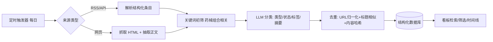

# 法规情报追踪系统 · 简单 PRD

> 面向药械组合（Combination Products）领域的法规情报自动采集与看板检索系统
> 产出：许清楚（产品经理）｜格式：简单 PRD（不含竞品分析）｜语言：中文

---

## 1. 项目信息

| 项 | 内容 |
|---|---|
| Language | 中文 |
| Programming Language | Vite + React + MUI + Tailwind CSS（默认技术栈） |
| Project Name | `reggov_tracker` |
| 部署形态 | 云端长期部署，7×24 自动每日抓取，架构预留云部署能力 |
| 目标用户 | 周总（非技术商业决策者，英文流利、以中文为主，关注中国市场的机会与合规风险） |
| 原始需求 | 每日自动从 NMPA / FDA / EMA 抓取与"药械组合 / combination products"相关的法规、指南、征求意见、批准动态，结构化存储，并通过 Web 看板供检索、筛选、持续跟踪，从而识别中国市场商业机会与合规风险 |

---

## 2. 产品定义

### 2.1 Product Goals（3 个正交目标）

1. **G1 · 全量自动采集**：以最小人工干预，稳定、每日、可去重地从首批监管源（NMPA/FDA/EMA）采集药械组合相关动态，结构化入库。
2. **G2 · 高效检索与筛选**：让非技术用户通过来源、类型、状态、标签、时间线与关键词，秒级定位目标法规，降低信息获取门槛。
3. **G3 · 机会/风险洞察**：通过语义标签与状态维度，帮助用户快速识别"征求意见中"（可提前布局/参与反馈）与"已生效/已更新"（合规风险）的信号。

### 2.2 User Stories

- **US1**：作为商业决策者，我希望打开看板就能看到最近按时间线排列的药械组合法规动态，以便掌握全球最新进展。
- **US2**：作为关注中国市场的人，我希望按"来源=NMPA"和"类型=征求意见"筛选，以便及时发现可参与反馈或存在合规风险的中国议题。
- **US3**：作为跨监管对比者，我希望用"标签=预充式注射器"跨 NMPA/FDA/EMA 检索，以便对比同一产品形态在不同市场的监管要求差异。
- **US4**：作为非技术用户，我希望看板提供中文摘要，以便不必精读英文原文即可判断相关性。
- **US5**：作为长期跟踪者，我希望把某条法规标记为"持续关注"并查看其状态变更历史，以便跟踪从征求意见到生效的全过程。

---

## 3. 药械组合语义标签体系（定义边界）

不依赖单一关键词，而是建立**两级语义标签**，由 LLM 分类 + 规则兜底打标：

### 3.1 组合形态标签（一级，必须覆盖需求中提到的边界）

| 标签 | 英文 | 说明 |
|---|---|---|
| 预充式注射器 | prefilled syringe | 器械载药典型形态 |
| 自动注射笔 | auto-injector | 含笔式/可穿戴注射 |
| 药物涂层器械 | drug-coated device | 如药物涂层球囊/支架 |
| 生物材料组合 | biomaterial combination | 含组织工程/再生组合 |
| 伤口闭合组合 | wound closure combination | 含含药敷贴/止血组合 |
| 吸入组合产品 | inhaled combination | 含药装置/吸入器 |
| 植入式给药系统 | implantable drug delivery | 含植入泵/植入缓释 |
| 透皮给药组合 | transdermal combination | 含贴剂组合 |
| 其他组合产品 | other combination | LLM 判定的其它形态 |

### 3.2 维度标签（二级，用于交叉分析）

- **监管路径**：器械主导 / 药物主导 / 交叉标记（cross-labeled）
- **治疗领域**：肿瘤 / 糖尿病 / 心血管 / 自免 / 抗感染 / 其他
- **信号类型**：机会信号 / 风险信号 / 中性动态（由 LLM 初步判定，可人工校正）

> 说明：标签由采集后的 LLM 分类器产出（输入标题+摘要+正文片段，输出形态标签+维度标签）；规则层用关键词白名单兜底，确保"combination product / 药械组合 / prefilled / auto-injector"等强信号不被漏标。

---

## 4. 采集机制与务实策略（现实约束）

监管站点多数无干净 REST API，MVP 按"成本由低到高"排序采用不同策略：

| 来源 | 可行性 | 建议采集策略（MVP） | 优先级 |
|---|---|---|---|
| **FDA**（含 OCP / CDER / CDRH / CBER） | 高，RSS 成熟 | 优先消费官方 RSS（Guidance Documents、Recalls、Approvals、News）；OCP 组合产品页做定点抓取 | P0 |
| **EMA**（含 CHMP 意见、协调指南） | 高，有 API/RSS | 使用 EMA 公开 RSS 与 medicines API；CHMP 意见走结构化接口 | P0 |
| **NMPA / CDE / CMDE** | 中，无统一公开 API | 网页抓取 + 关键栏目监控（CDE"指导原则/征求意见"、CMDE"信息公开/指导原则"、NMPA 新闻）；关键词 + LLM 分类过滤 | P0（工程投入较大，需专项） |

**通用采集管线（mermaid）：**



**去重策略**：`original_url` 归一化（去参数/锚点）→ 标题规范化后相似度比对 → 正文片段内容哈希；命中则标记为 `is_duplicate_of` 而非重复入库。

---

## 5. 需求池（P0 / P1 / P2）

### P0（MVP 必须有）
- **P0-1** 每日自动采集：定时任务稳定触发 FDA/EMA/NMPA 抓取，失败可重试与告警。
- **P0-2** 结构化入库：按 §6 schema 落库，字段完整。
- **P0-3** 基础看板检索与筛选：支持来源、类型、状态、标签、时间范围、标题/全文关键词的组合筛选。
- **P0-4** 来源与类型分类：每条记录必须带 `source` 与 `type` 且可筛选。
- **P0-5** 去重：采集链路内置去重，避免重复条目。
- **P0-6** 时间线视图：按发布日期/生效日期排序展示，默认显示最近 N 条。

### P1（应做）
- **P1-1** 中文摘要：LLM 生成中文摘要，降低英文阅读门槛。
- **P1-2** 语义标签体系落地：形态标签 + 维度标签自动打标与展示。
- **P1-3** 状态维度可视化：明确"征求意见中/已生效/已更新/已废止"并支持筛选。
- **P1-4** "持续关注"标记与状态变更历史追踪。
- **P1-5** 采集健康监控面板：各源最近成功时间、失败告警。

### P2（可选 / 后续）
- **P2-1** 邮件 / 企微 / 飞书增量推送（日报/周报）。
- **P2-2** 跨市场监管要求对比视图。
- **P2-3** 历史数据回溯补抓（>1 年）。
- **P2-2** 多用户与细粒度权限/登录鉴权。
- **P2-3** 法规影响评级（自动评估对中国市场机会/风险强度）。

---

## 6. 数据字段 Schema 草案

| 字段 | 类型 | 说明 |
|---|---|---|
| `id` | string | 主键（UUID） |
| `title` | string | 标题（原文语言） |
| `source` | enum | NMPA / FDA / EMA |
| `source_sub` | string | 子机构：CDE / CMDE / OCP / CDER / CDRH / CBER / CHMP 等 |
| `publish_date` | date | 发布日期 |
| `effective_date` | date? | 生效日期（可选） |
| `type` | enum | 指南 / 法规 / 征求意见 / 批准 / 其他 |
| `status` | enum | 征求意见中 / 已生效 / 已更新 / 已废止 |
| `summary` | text | LLM 生成的中文摘要 |
| `tags` | string[] | 语义标签（形态 + 维度） |
| `original_language` | enum | zh / en |
| `original_url` | string | 原文链接 |
| `content` | text? | 正文/正文片段（可选，用于检索与摘要） |
| `fetched_at` | datetime | 抓取时间 |
| `is_duplicate_of` | string? | 去重关联的主记录 id |
| `watch` | bool | 是否标记持续关注 |
| `status_history` | json? | 状态变更记录（P1） |

---

## 7. UI 设计稿（看板主界面线框）

```
┌──────────────────────────────────────────────────────────────────────┐
│  法规情报追踪 · 药械组合            [🔍 全文/标题搜索框________] [⚙]   │
├───────────────────┬──────────────────────────────────────────────────┤
│  筛选区 (左栏)     │   列表 / 时间线区 (右主区)                        │
│                   │                                                    │
│  来源 ☑ NMPA      │   ┌─ 时间线 / 列表 切换 ─────────────────────┐   │
│        ☑ FDA      │   │ 2026-07-18  ● FDA · CDER · 指南          │   │
│        ☑ EMA      │   │   预充式注射器无菌要求更新        [标签]   │   │
│                   │   │   [中文摘要一行]……            [查看原文] │   │
│  类型 ☑ 指南      │   │ ——————————————————————————————            │   │
│       ☑ 法规      │   │ 2026-07-17  ● NMPA · CDE · 征求意见      │   │
│       ☑ 征求意见  │   │   药物涂层球囊指导原则(征)      [标签][⭐] │   │
│       ☑ 批准      │   │   [中文摘要]……                [查看原文] │   │
│                   │   │ ——————————————————————————————            │   │
│  状态 ☑ 征求意见中│   │ 2026-07-15  ● EMA · CHMP · 批准          │   │
│       ☑ 已生效    │   │   ...                                      │   │
│       ☑ 已更新    │   └────────────────────────────────────────────┘ │
│       ☑ 已废止    │   [分页 / 加载更多]                               │
│                   │                                                    │
│  标签 [预充式注射器]│                                                    │
│       [自动注射笔] │                                                    │
│       [药物涂层…] │                                                    │
│                   │                                                    │
│  时间范围 [近30天▾]│                                                    │
│                   │                                                    │
│  [重置筛选]       │                                                    │
└───────────────────┴──────────────────────────────────────────────────┘
```

- **顶部栏**：全局搜索（标题/全文）+ 设置入口。
- **左栏筛选区**：来源 / 类型 / 状态 多选，标签快捷选择，时间范围，重置。筛选条件可组合。
- **主区**：默认时间线视图（按日期倒序），可切列表；每条卡片显示来源/子机构/类型/状态徽标、语义标签、中文摘要、原文链接、关注星标。
- 响应式：左栏在窄屏折叠为抽屉。

---

## 8. 待确认问题（Open Questions）

1. **采集频率与时区**：每日一次是否足够？FDA 等关键源是否需要更高频（如每 6 小时）？触发时间与时区如何设定？
2. **推送需求**：MVP 是否需要邮件 / 企微 / 飞书增量推送（日报/周报）？还是仅看板即可（影响 P2 是否提前）？
3. **历史回溯深度**：是否需要补抓过去多久的历史数据（1 年 / 3 年 / 5 年）？影响初始入库工作量与采集脚本设计。
4. **登录鉴权**：MVP 是否需要账号体系与鉴权？初期若仅单人/内网访问，可否免登录（影响 P2-2 是否进 P0）？
5. **LLM 调用与数据合规**：摘要/分类使用哪家模型？NMPA 中文内容调用境外模型是否存在数据出境合规风险？是否需境内模型或本地化部署？
6. **摘要/翻译策略**：是否需要中英对照或纯中文摘要？周总英文流利，是否摘要即可、原文按需查看？
7. **"状态"字段可靠性**：部分源不显式标注"已更新/已废止"，是否接受 LLM 推断 + 人工校正？是否需要人工审核工作流？
8. **云部署地域与合规**：NMPA 内容抓取与存储的合规边界？云部署选国内还是海外节点？
