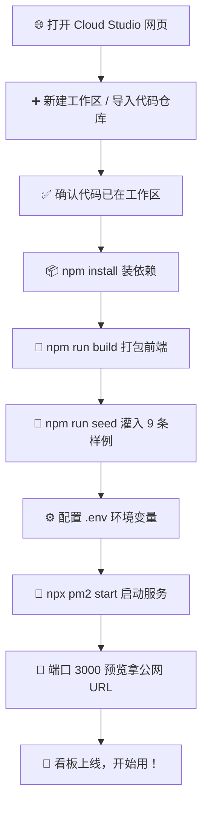

# 法规情报追踪看板 · 零基础部署清单（给周总，一步步点哪里）

> 这份清单是专门给**完全不懂代码**的朋友写的。您只需要会打开网页、会点按钮、会复制粘贴就行。
> 照着「第一步、第二步」往下做，十几分钟就能看到属于自己的法规看板跑起来。
> 每一步都写清楚了**在屏幕上点哪里、填什么**。跟着做，没问题！👍

---

## 📋 部署全流程一览（先看这张图，心里有底）



> 💡 **一句话版**：打开网站 → 建空间（自动拉代码）→ 确认代码到位 → 装依赖 → 打包 → 灌样例 → 配环境 → 启动 → 拿链接 → 看板上线。
> 下面每一节都会把上面这些步骤拆开，手把手教您。

---

## 第一步：打开 Cloud Studio 并新建工作区

1. 在浏览器里打开这个网址（建议用 Chrome 或 Edge）：
   👉 **https://cloudstudio.net**

   > 💡 您会看到一个登录页面。用微信扫码，或者用手机号登录都可以，能进去就行。

2. 登录后，看页面**左上角**，找到蓝色的 **「新建」** 按钮，点它。

3. 在弹出的新建面板里，会问您「选择模板」。请找到并点击 **「代码仓库」** 这张卡片（有的界面叫「从 Git 仓库导入」）。

   > ⚠️ 注意：不要选「空白工作区」或「模板市场」里别的选项，就选**代码仓库**这一张。因为选它并填好仓库地址后，Cloud Studio 会在创建工作区时**自动把代码拉进工作区**——您后面**不需要**再手动 clone 一次。

4. 在它出现的 **「仓库地址」输入框** 里，把下面这行整段复制粘贴进去：

   ```
   https://github.com/jackbest886/CPR.git
   ```

   > 💡 填好这个地址、点创建后，Cloud Studio 会替您把代码下载好。所以**走「代码仓库」这条路，您全程都不用自己敲 clone 命令**，直接进入第二步「确认代码已到位」即可。

5. 在「运行环境 / 模板」那里，选择 **「Node.js」**（如果列表里没有 Node.js，就选 **「Ubuntu」**，两者都自带运行环境）。

   > 💡 选 Node.js 就好，它里面已经预装了我们需要的 Node 18+ 环境，不用您再装任何东西。

6. 给工作区随便起个名字（比如 `reggov-tracker` 或者「法规看板」），然后点页面下方的 **「创建」** 或 **「确定」** 按钮。

   > ⚠️ 创建过程大概要等 10~30 秒，页面在「转圈」是正常现象，别急着关。

---

## 第二步：确认代码已到位（不用手动克隆）

工作区建好后会自动打开一个**代码编辑界面**，下半部分有一条**黑色（或深色）的「终端」窗口**，叫做「终端」。我们后面的命令都扔进这个窗口里。

> 💡 如果没看到终端，看页面顶部或底部有没有写着 **「终端」** 两个字的小标签，点一下它就能打开。

**关键：您第一步选的是「代码仓库」并填了仓库地址，Cloud Studio 已经自动把代码下载进工作区了，所以这里【不需要】再手动 clone。**

请看一下界面**左侧的文件列表**，确认里面有没有这三个（有就说明代码已经在）：

- `package.json`（项目配置文件）
- `client`（前端代码文件夹）
- `server`（后端代码文件夹）

> 💡 只要看到这几个，代码就齐了，直接跳到**第三步**。

**特殊情况**：如果您第一步建的是「空白工作区」（没走代码仓库导入），左侧才会是空的，这时才需要在终端里粘贴下面这行、回车，把代码拉进来：

```bash
git clone https://github.com/jackbest886/CPR.git .
```

> ⚠️ 注意末尾有个**空格加一个点** `.`，要一起复制。
> 如果终端提示「目录非空」，说明代码可能已经在里面了，**不用管，直接进第三步**。

---

## 第三步：安装依赖（npm install）

继续在终端里，**粘贴这行，回车**：

```bash
npm install
```

> 💡 这一步会「哗啦啦」下载很多东西，可能要等 1~3 分钟。只要最后没报红色的大段错误，就是成功了。

---

## 第四步：打包前端页面（npm run build）

在终端里，**粘贴这行，回车**：

```bash
npm run build
```

> 💡 几秒到十几秒就完事，看到 `dist` 或 `built` 之类字眼表示成功。这一步是把网页「编译」成浏览器能直接打开的版本。

---

## 第五步：灌入 9 条精选法规样例（npm run seed）

在终端里，**粘贴这行，回车**：

```bash
npm run seed
```

> 💡 这步会往数据库里写入 9 条精心挑选的法规样例（FDA、EMA、NMPA 各 3 条）。
> 即使您**没有填任何 API Key**，这 9 条也会正常显示，看板一打开就有内容，不空场。
> 这步可以随时重复跑，不会把数据写重复（系统会自动跳过已有的）。

---

## 第六步：配置环境变量（配 .env）

这一步是「告诉系统怎么运行」。我们先用一行命令生成一个配置文件，再往里改几个值。

### 6.1 先生成配置文件

在终端里，**粘贴这行，回车**：

```bash
cp .env.example .env
```

> 💡 您会多出一个名叫 `.env` 的文件，它就是我们的配置本。

### 6.2 打开并编辑 .env 文件

在左侧的**文件列表**里，找到并**双击打开 `.env`** 这个文件（它可能排在比较靠后，因为名字以点开头）。

打开后，里面已经有很多行。您**只需要关心下面几行**，按其要求修改：

| 字段 | 要不要改 | 改成什么 / 说明 |
|------|---------|----------------|
| `COLLECTION_ENABLED` | ✅ **必须改** | 把后面的 `false` 改成 `true`，这样系统才会每天自动去采集最新法规 |
| `LLM_API_KEY` | ⬜ **可留空** | 现在**不用填**（留空也完全能用）。等以后想要更聪明的 AI 中文分类，再去领一个免费的 Key 填进来 |
| `HOST` / `PORT` / `TZ` | ⬜ 不用动 | 已经默认配好（0.0.0.0 / 3000 / Asia/Shanghai） |
| `KEEPALIVE_ENABLED` | ⬜ 不用动 | 默认 `true`，让服务不会半夜「睡着」 |
| 其他 `LLM_*` 字段 | ⬜ 不用动 | 等有了 Key 再管 |

> ⚠️ **最容易漏的一步**：请一定把 `COLLECTION_ENABLED=false` 改成 `COLLECTION_ENABLED=true`。漏改的话，系统不会自动采集，但看板本身还是能看的（靠第 5 步的 9 条样例）。

### 6.3 如果您想直接复制一份「改好的范本」

如果您嫌一行行找麻烦，可以把下面这一整段**直接复制，全部粘贴覆盖**到 `.env` 文件里（它已经帮您把 `COLLECTION_ENABLED` 改成 `true`、`LLM_API_KEY` 留空了）：

```ini
# ===== 数据库 =====
DB_TYPE=sqlite
DB_PATH=./data/reggov.db
DATABASE_URL=

# ===== 服务 =====
HOST=0.0.0.0
PORT=3000
TZ=Asia/Shanghai

# ===== 采集调度 =====
COLLECTION_ENABLED=true
CRON_ENABLED=true
COLLECT_CRON=0 8 * * *
RUN_ON_START=false

# ===== 采集校验 =====
COLLECT_RECENT_DAYS=90

# ===== 自 ping 保活（防休眠）=====
KEEPALIVE_ENABLED=true
KEEPALIVE_INTERVAL_MS=300000

# ===== LLM 分类器（可选，先留空也能用）=====
LLM_PROVIDER=qwen
LLM_API_KEY=
LLM_MODEL=qwen-plus
LLM_BASE_URL=https://dashscope.aliyuncs.com/compatible-mode/v1

# ===== 鉴权（默认关闭，免登录）=====
AUTH_ENABLED=false

# ===== NMPA 栏目（留空用默认）=====
NMPA_COLUMNS=
```

> 💡 改完之后，记得按 `Ctrl + S`（或点界面上的「保存」）把文件存下来。

### 6.4 关于「没有 Key 也能用」这件事（请您放心）

很多朋友担心「我没填那个 API Key，会不会跑不起来？」——**不会。**

- 不填 `LLM_API_KEY`：系统走**内置的规则分类器**（关键词自动判断法规属于哪一类），看板**完整可用**，9 条样例和以后采集的法规都能正常中文展示。
- 以后想升级成「AI 智能分类」：去阿里云百炼 / 通义开放平台领一个**免费的** Key，填进 `LLM_API_KEY`，然后在终端跑 `npx pm2 restart reggov-tracker` 重启一下，系统就自动切换成更聪明的 AI 分类了。

---

## 第七步：启动服务（pm2 守护启动）

在终端里，**粘贴这行，回车**：

```bash
npx pm2 start ecosystem.config.cjs
```

> 💡 这条命令一跑，系统就在后台「常驻」起来了，关掉终端窗口也不会停。
> 想确认它活着，就跑 `npx pm2 list`，看到 `reggov-tracker` 状态是 `online` 就对了。

想看它在后台都干了啥，可以跑：

```bash
npx pm2 logs reggov-tracker
```

> 💡 日志里如果出现 `[keepalive] self-ping ok` 这种字，说明「防休眠保活」也在正常工作，好事。

**pm2 帮您做的几件省心事（不用您操心）：**
- 程序万一崩了，它会**自动重启**（最多 10 次，每次隔 5 秒）；
- 它每 5 分钟自己「ping」自己一下，防止 Cloud Studio 免费版**睡着**导致看板打不开。

---

## 第八步：拿到公网链接，打开看板

1. 在工作区界面里，找到 **「端口」** 或 **「预览」** 相关的标签/按钮（通常在终端旁边，或者顶部工具栏）。
2. 找到端口号 **`3000`**，点它旁边的 **「访问」** 或 **「预览」** 或 **「打开浏览器」** 按钮。

   > 💡 点完会弹出一个网址，长这样：`https://xxxx-3000.app.cloudstudio.dev` 之类的。
   > 这个网址就是您的**看板公网地址**，发给同事、用手机都能打开。

3. 把那个网址复制到浏览器地址栏，回车——**看板就出现了！** 🎉

---

## ✅ 部署完成自检清单（照着打勾）

部署完，请逐条确认，全勾上就大功告成：

- [ ] ☑ 能打开第八步拿到的**公网网址**，页面正常显示（不是白屏/报错）
- [ ] ☑ 看板首页能看到 **9 条精选法规**（FDA / EMA / NMPA 各 3 条）
- [ ] ☑ 在浏览器地址栏末尾加上 `/api/health` 打开（如 `https://xxxx-3000.app.cloudstudio.dev/api/health`），页面返回 `200` 或 `ok` 字样
- [ ] ☑ 终端里 `npx pm2 list` 显示 `reggov-tracker` 状态为 `online`
- [ ] ☑ `.env` 里 `COLLECTION_ENABLED=true` 已改好并保存
- [ ] ☑ 关掉终端窗口几分钟后，重新打开公网网址，看板依然能访问（说明保活生效）
- [ ] ☑ （可选）在日志 `npx pm2 logs reggov-tracker` 里看到 `[keepalive] self-ping ok`

---

## 🔍 部署后怎么确认「自动采集」真的跑起来了

> 这一段专门教您：部署完之后，怎么用最简单的方式确认「自动采集」确实在工作（而不是只挂了个空壳看板）。
> 您不需要懂代码，照着下面「第一步到第六步」点一点、复制粘贴几行就行。

---

### 第一步：先确认「采集总开关」是开着的

回顾本文「第六步」：您当时把 `.env` 里的 `COLLECTION_ENABLED` 改成了 `true` 并保存了。这就是自动采集的总开关。

> ⚠️ 注意：您**没法**在 `/api/health`（健康检查）那个接口的返回里看到这个开关——那段返回里根本没有「采集开关」这一项。想确认它开没开，要么回到 `.env` 文件里看一眼那行是不是 `true`，要么直接看下面的「第三步」采集记录：只要采过，就说明开关是开着的。

---

### 第二步：手动触发一次采集（不用等到明天早上 08:00）

在终端里粘贴这行，回车：

```bash
curl -X POST http://localhost:3000/api/collect/run
```

> ⚠️ 公网提醒：上面这行是按「在 Cloud Studio 自带终端里操作」写的。如果您是**在自己的电脑**（Windows / Mac）上开终端跑这条命令，请把 `localhost:3000` 换成第八步拿到的公网网址，例如 `https://xxxx-3000.app.cloudstudio.dev`，否则连不上云上的服务。

> 💡 你会看到：屏幕返回一段文字（JSON），重点看两块：
> - 最外层的 `"status"`：如果是 `"success"` 或 `"partial"`，说明采集已经跑起来了。
> - 里面的 `"perSource"`：它按来源（FDA / NMPA / EMA）分别列出一个数字 `"count"`，表示这次各自成功搬回来的法规条数。例如 `"FDA":{"count":0}`、`"NMPA":{"count":2}`、`"EMA":{"count":0}`。
> 某来源的 `count` 是 0 没关系（见第六步解释）；但如果某个来源后面跟着 `"error":"..."`，说明那个来源出错了。

---

### 第三步：看上一次采集的运行记录

在终端里粘贴这行，回车：

```bash
curl http://localhost:3000/api/collect/status
```

（同样：在自己电脑上跑就把 `localhost:3000` 换成第八步的公网网址。）

> 💡 你会看到：返回里 `data` 是一段采集记录：
> - `"status"`：应为 `"success"`（或 `"partial"`）。
> - `"finished_at"`：是一个时间，而且离「现在」很近（说明刚刚确实采过）。
> - `"per_source"`：是一长串内容（各来源的情况），看着像一大坨文字是正常的。
>
> ⚠️ 注意：如果您看到 `data: null`（也就是 `data` 是空的），说明系统**还从来没采过**——请先回到「第二步」手动触发一次，再回来看这里。

---

### 第四步：回看板看看条目有没有变多

最简单的方法：刷新您第八步打开的看板首页（在浏览器里按 F5），看看法规是不是比最初的 9 条多了。

也可以用一行命令确认总数：

```bash
curl http://localhost:3000/api/stats
```

（自己电脑上跑就换成公网网址。）

> 💡 你会看到：返回里的 `bySource` 会分别列出 FDA / NMPA / EMA 各有多少条，把这几个数加总就是看板法规总数。只要总数**大于 9**，就说明自动采集已经把新法规搬进看板了（因为最初只有 9 条样例）。没变多也别急，很多时候是官方近期没发布新药械组合法规，见第六步。

---

### 第五步：看后台日志（可选，想知道更多细节时看）

在终端里粘贴这行，回车：

```bash
npx pm2 logs reggov-tracker
```

> 💡 你会看到：不断滚动的后台流水账。找带 `[pipeline]` 字样、以及「采集 X 条」「入库 X 条」这类字眼，就说明采集过程确实在跑。想停下来只看结果，按 `Ctrl + C` 即可（这只会停掉日志查看，不会关掉服务）。

---

### 第六步：几种常见现象怎么看（避免自己吓自己）

- **`status` 是 `success`，但某个来源的 `count` 是 0 → 这完全正常！** 说明官方最近一段时间没有新的「药械组合」法规发布，或者命中的内容被系统的四重校验正确挡掉了，不是出 bug，也不用处理。
- **`status` 是 `failed` →** 看返回里的 `error` 字段写了什么，或者回到第五步日志里找红色报错字，按提示处理（通常是网络或某个官网暂时打不开）。
- **连不上官网 →** Cloud Studio 默认是能联网的，采集需要去访问 FDA / NMPA / EMA 的官网。连不上多半是网络波动，或采集时间点还没到，等一会儿再手动触发一次即可。
- **想让它每天自动跑，您啥都不用管：** 自动任务（cron）已经设好在 `0 8 * * *`，也就是**每天上午 08:00** 自动采集一次。您只要保持服务在线，剩下的交给系统。

---

## 🔧 故障排查（遇到不对劲，看这里）

| 您看到的现象 | 大概率是啥原因 | 您能做的处理 |
|------|---------|---------|
| 看板打开是**白屏** | 前端没打包好 / 服务没起来 | 重跑 `npm run build`，再 `npx pm2 restart reggov-tracker` |
| 打开网址提示**连不上** | 服务没启动，或端口没预览 | 跑 `npx pm2 list` 看是不是 `online`；确认第 8 步端口 3000 已点「预览」 |
| `/api/health` 打不开 | 服务还没完全起来 | 等 10 秒再试；`npx pm2 logs reggov-tracker` 看有没有红色报错 |
| 看板**只有 9 条**，没新增 | 还没到每天 08:00 自动采集时间 | 正常，等第二天早上；或手动触发见下方「速查」 |
| 看板**半夜打不开** | Cloud Studio 免费版睡着了 | 确认 `.env` 里 `KEEPALIVE_ENABLED=true`（默认就是，一般不用管） |
| 终端里程序**反复重启** | 端口被占 / 依赖没装全 | 重跑 `npm install`；`npx pm2 logs reggov-tracker` 看红色错误堆栈 |

> ⚠️ 大多数「打不开」都是因为**漏了某一步**或**命令没等它跑完就下一步**。退回对应步骤重做一遍即可，不会搞坏任何东西。

---

## 📜 常用命令速查（贴在这里，随用随查）

> 用法：在终端里**粘贴对应那行，回车**即可。

**日常开关：**
```bash
npx pm2 start ecosystem.config.cjs   # 启动看板
npx pm2 list                         # 看看它还在不在跑（online 就是正常）
npx pm2 logs reggov-tracker          # 看后台日志（排查问题用）
npx pm2 restart reggov-tracker       # 改了 .env 后，用它重启生效
npx pm2 delete reggov-tracker        # 不想要了，彻底关掉
```

**重新安装 / 打包 / 灌数据（重做部署用）：**
```bash
npm install      # 装依赖
npm run build    # 打包前端
npm run seed     # 重新灌 9 条样例（可重复跑，不会重复）
```

**手动让系统立刻去采一批新法规（不用等明天）：**
```bash
curl -X POST http://localhost:3000/api/collect/run     # 立刻采集一次
curl http://localhost:3000/api/collect/status          # 看采集状态
curl http://localhost:3000/api/health                  # 健康检查（返回 200 即正常）
```

**开发者才用得到的（您一般不用管）：**
```bash
npm run dev         # 本地调试热重载
npm run typecheck   # TypeScript 类型检查
npm test            # 跑测试
```

---

## 📦 数据放在哪 / 备份（了解即可）

- 所有法规数据存在工作区里的 `./data/reggov.db` 这个文件（SQLite 数据库），**跟着工作区走**，工作区不删它就在。
- 想备份，就在终端跑：
  ```bash
  cp data/reggov.db data/reggov.db.bak.$(date +%Y%m%d)
  ```
  > 💡 这会在同一目录复制一份带日期的备份，哪天数据不对还能还原。

---

## 🛡️ 无 Key 部署说明（再强调一次，安心用）

1. **不填 `LLM_API_KEY`**：系统走**规则分类器**（关键词自动判断 + 抽取式摘要），完全可运行，看板照常显示中文分类。
2. 英文法规条目会通过内置的简易英→中关键词映射兜底，也能正常归类。
3. 等您领到免费 Key 后：填进 `.env` 的 `LLM_API_KEY` → 跑 `npx pm2 restart reggov-tracker` → 系统自动升级成 qwen-plus 智能分类，**无需改任何代码**。

---

> 🎊 **恭喜您！** 走到这里，您的「法规情报追踪看板」已经稳稳跑在云上了。
> 以后每天早上 08:00，它会自动去 NMPA / FDA / EMA 把最新的药械组合法规搬回来、分好类、用中文展示给您。
> 有任何打不开的情况，回到上面的「故障排查」表照着查就行。祝好用！
