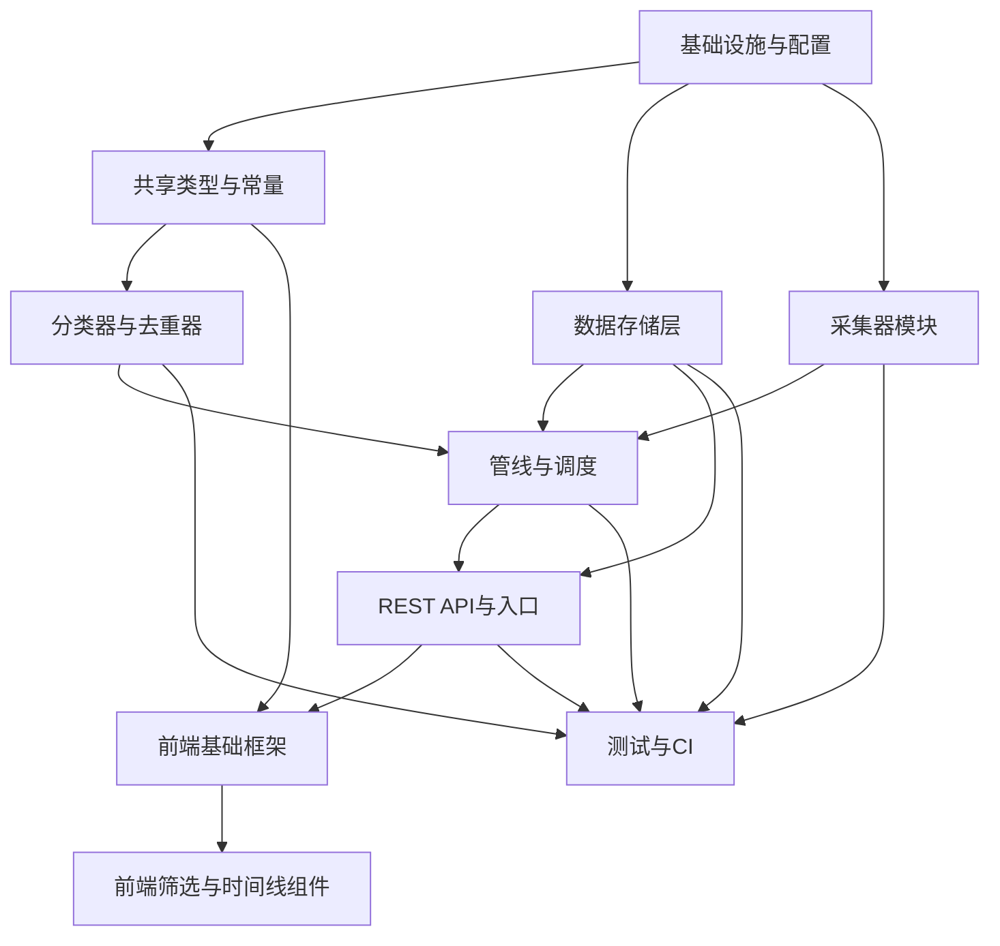

# 法规情报追踪系统（reggov_tracker）· 系统架构设计与任务分解

> 产出角色：架构师（高见远 / Bob）
> 面向：工程师（实现清单）+ 团队负责人（评审）
> 语言：中文 | 形态：Web 看板 + 单 Node 全栈服务 + 每日自动采集

---

## Part A：系统设计

### 1. 实现方案 + 框架选型

#### 1.1 核心难点
1. **多源异构采集**：FDA 有成熟 RSS；EMA 有 API/RSS；NMPA/CDE/CMDE 无统一公开 API，需网页抓取 + 关键词过滤，工程投入最大且页面结构易变。
2. **无干净结构化的"药械组合"信号**：监管原文不显式标注"药械组合/combination products"，需关键词初筛 + 分类（类型/状态/标签/摘要）。
3. **数据出境合规**：NMPA 中文内容走境外 LLM 有合规风险 → 默认规则分类器为主，LLM 可插拔、默认关闭。
4. **云端 7×24 稳定**：调度、失败重试、告警、去重、幂等入库；存储零运维（SQLite + 挂载卷），又能切换 Postgres。

#### 1.2 技术栈与选型（含理由）

| 层 | 选型 | 版本建议 | 理由 |
|---|---|---|---|
| 构建/前端 | Vite + React | vite@^5.4, react@^18.3 | PRD 默认；构建为静态资源由后端托管，部署单一 |
| UI 组件 | MUI v5 + Emotion | @mui/material@^5.16 | 开箱即用组件（卡片/筛选/抽屉/徽标），非技术用户友好 |
| 样式 | Tailwind CSS | ^3.4 | 与 MUI 并存（Tailwind 负责布局间距，MUI 负责组件） |
| 后端框架 | Express | express@^4.19 | 生态成熟、易托管静态资源与 REST；比 Fastify 更省心智、易测试 |
| 定时调度 | node-cron | ^3.0.3 | 轻量 cron；支持 `0 8 * * *` 与 `0 */6 * * *`，容器内 TZ=Asia/Shanghai |
| 存储 | SQLite (better-sqlite3) | ^11.3 | 零运维、同步 API、CI 友好；容器挂载卷持久化 |
| 存储适配器 | pg（Postgres） | ^8.12 | 通过 `DB_TYPE` 切换；MVP 仅验证 SQLite，pg 路径提供实现+单测 mock |
| 迁移 | 手写迁移（SQL + 版本表） | — | 比 Prisma/TypeORM 更省文件数、部署更简单，满足 ≤25 文件 |
| RSS 解析 | rss-parser | ^3.13 | FDA/EMA RSS 成熟，标准库 |
| HTML 抽取 | cheerio | ^1.0 | NMPA 网页抽取 + FDA OCP 组合产品页 |
| HTTP | Node 内置 fetch（Node 18+） | — | 不引 axios，降依赖 |
| 校验 | zod | ^3.23 | API 入参/LLM 输出校验 |
| 配置 | dotenv | ^16.4 | 加载 .env |
| LLM（可选） | openai SDK（OpenAI 兼容） | ^4.55 | 仅当 `LLM_API_KEY` 配置时启用；缺省走规则分类器 |
| 测试 | vitest | ^2.0 | 单测核心模块；collector 用本地 fixtures，CI 不触外网 |

#### 1.3 架构模式
- **后端分层**：采集层（collectors）→ 分类/去重层 → 管线编排（pipeline）→ 数据访问层（repository + db adapter）→ REST 层（routes）→ 入口（index）。各 collector/classifier 通过接口解耦，可插拔替换。
- **前端**：单页组件化；App 持有筛选状态 + 数据获取，组件纯展示（TopBar / FilterPanel / TimelineView / RegCard）。
- **部署**：单仓库单服务；生产构建 `client` 产物由 `server` 在 `/` 托管；`Dockerfile` + `docker-compose.yml` 挂载 SQLite 卷。

---

### 2. 文件列表（相对仓库根，≤25 产品源文件）

> 计：共享 2 + 服务端 15 + 客户端 7 = **24 个产品源文件**（满足 ≤25）。下列"基础设施/测试"文件不计入配额。

#### 基础设施（不计源文件配额）
- `package.json`（根：scripts 含 dev/build/start/test，依赖聚合）
- `.env.example`（全部环境变量样例）
- `Dockerfile`、`docker-compose.yml`
- `tsconfig.json`（根）、`vitest.config.ts`
- `client/index.html`、`client/vite.config.ts`、`client/tailwind.config.js`、`client/postcss.config.js`、`client/tsconfig.json`

#### 共享层 `shared/`
1. `shared/types.ts` — 枚举类型、RawItem、Regulation、Classification、API 请求/响应类型、Filter 类型。
2. `shared/constants.ts` — 来源/类型/状态枚举值、药械组合两级标签体系、采集源配置（RSS/栏目 URL 列表，可配置）、env 变量名清单。

#### 服务端 `server/`（15）
3. `server/config.ts` — 读取 .env → 强类型 Config 对象（DB_TYPE/PORT/CRON/LLM/AUTH…）。
4. `server/db/connection.ts` — `DbAdapter` 接口 + `SqliteAdapter`（`better-sqlite3`）+ `PgAdapter`（`pg`，`$1` 占位）+ `createDb()` 工厂（按 `DB_TYPE` 选择）。
5. `server/db/migrations.ts` — 建表/索引 SQL + `runMigrations()`（版本表 `__migrations__`）。
6. `server/db/repository.ts` — `RegulationRepository`：search/filter、getById、save（含去重标记）、update（watch/status + 追加 status_history）、run-status 读写。
7. `server/collectors/base.ts` — `Collector` 接口、`RawItem` 契约、来源注册表 `collectors: Collector[]`。
8. `server/collectors/fda.ts` — `FdaCollector`：消费官方 RSS（Guidance/Recalls/Approvals/News）+ OCP 组合产品页 cheerio 抓取。
9. `server/collectors/ema.ts` — `EmaCollector`：EMA 公开 RSS + medicines API（CHMP 意见结构化）。
10. `server/collectors/nmpa.ts` — `NmpaCollector`：CDE/CMDE 关键栏目 cheerio 抓取 + 关键词初筛。
11. `server/classifiers/index.ts` — `Classifier` 接口 + `RuleClassifier`（默认，关键词/正则映射）+ `createClassifier()` 工厂（按 env 选规则或 LLM）。
12. `server/classifiers/llm.ts` — `LlmClassifier`：OpenAI 兼容调用，结构化输出 type/status/tags/summary，失败回退规则。
13. `server/deduplicator.ts` — `Deduplicator.isDuplicate(item)`：URL 归一化 → 标题相似度（Jaccard/编辑距离 ≥0.85）→ 正文 sha256；返回 `dupId | null`。
14. `server/pipeline.ts` — `Pipeline.runOnce()`：遍历 collectors → classify → dedup → repository.save；产出 `RunReport`。
15. `server/scheduler.ts` — `Scheduler`：node-cron 启动 + `runNow()` 手动触发 + 启动可选 `RUN_ON_START`。
16. `server/routes.ts` — REST 路由：regulations 检索/详情/更新、meta/tags、health、collect/run、collect/status、stats。
17. `server/index.ts` — 入口：Express 装配、cors、静态托管 `client/dist`、挂载 routes、启动 scheduler。

#### 客户端 `client/src/`（7）
18. `client/src/main.tsx` — React 18 挂载入口。
19. `client/src/App.tsx` — 布局（TopBar + FilterPanel + 主区）、筛选状态、视图切换（时间线/列表）、数据获取编排。
20. `client/src/api.ts` — `fetchRegulations(filter)`、`fetchMeta()`、`fetchStats()`、`runCollection()`、`patchRegulation()` 等封装（基于 `/api`）。
21. `client/src/components/TopBar.tsx` — 全局搜索框（标题/全文）+ 设置入口（手动"立即运行一次采集"按钮）。
22. `client/src/components/FilterPanel.tsx` — 来源/类型/状态多选、标签快捷选择、时间范围、重置、窄屏抽屉。
23. `client/src/components/RegCard.tsx` — 单条卡片：来源/子机构/类型/状态徽标、语义标签、中文摘要、原文链接、关注星标。
24. `client/src/components/TimelineView.tsx` — 时间线（按 publish_date 倒序）与列表双视图渲染。

#### 测试与 fixtures（不计入 25 配额，附 minimal）
- `server/__tests__/classifier.test.ts`、`deduplicator.test.ts`、`collectors.test.ts`（含 `fixtures/fda.xml`、`fixtures/nmpa.html`）、`repository.test.ts`（`:memory:` SQLite）、`routes.test.ts`（supertest）。
- `vitest.config.ts`（含 setup）。

---

### 3. 数据结构与接口

#### 3.1 数据库表（SQLite；Postgres 用 JSONB 等价，repository 统一解析）

```sql
CREATE TABLE regulations (
  id               TEXT PRIMARY KEY,           -- UUID
  title            TEXT NOT NULL,
  source           TEXT NOT NULL,             -- NMPA|FDA|EMA
  source_sub       TEXT,                        -- 子机构 CDE/CMDE/OCP/CDER...
  publish_date     TEXT,                        -- YYYY-MM-DD
  effective_date   TEXT,                        -- YYYY-MM-DD, nullable
  type             TEXT NOT NULL,              -- 指南|法规|征求意见|批准|其他
  status           TEXT,                        -- 征求意见中|已生效|已更新|已废止, nullable
  summary          TEXT,                        -- 中文摘要
  tags             TEXT,                        -- JSON string: string[]
  original_language TEXT,                      -- zh|en
  original_url     TEXT NOT NULL,
  content          TEXT,                        -- nullable 正文
  fetched_at       TEXT NOT NULL,              -- ISO datetime (UTC, 'Z')
  is_duplicate_of  TEXT,                        -- nullable FK -> regulations.id
  watch            INTEGER NOT NULL DEFAULT 0, -- bool 0/1
  status_history   TEXT                         -- JSON string: [{status, at, by}]
);
CREATE INDEX idx_reg_source       ON regulations(source);
CREATE INDEX idx_reg_type         ON regulations(type);
CREATE INDEX idx_reg_status       ON regulations(status);
CREATE INDEX idx_reg_publish_date ON regulations(publish_date DESC);
CREATE INDEX idx_reg_original_url ON regulations(original_url);
CREATE INDEX idx_reg_watch        ON regulations(watch);

CREATE TABLE __migrations__ (version INTEGER PRIMARY KEY, applied_at TEXT);
CREATE TABLE collect_runs (
  id INTEGER PRIMARY KEY AUTOINCREMENT,
  started_at TEXT, finished_at TEXT,
  status TEXT,                         -- success|partial|failed
  per_source TEXT,                     -- JSON {FDA:{count,error},...}
  error TEXT
);
```

#### 3.2 核心 TS 类型（`shared/types.ts` 摘要）
```ts
export type Source = 'NMPA' | 'FDA' | 'EMA';
export type RegType = '指南' | '法规' | '征求意见' | '批准' | '其他';
export type RegStatus = '征求意见中' | '已生效' | '已更新' | '已废止'; // 可空
export type Language = 'zh' | 'en';

export interface RawItem {
  source: Source; sourceSub?: string; title: string; url: string;
  publishDate?: string; content?: string; language?: Language;
}
export interface Classification {
  type: RegType; status?: RegStatus; tags: string[]; summary: string;
}
export interface Regulation {
  id: string; title: string; source: Source; sourceSub?: string;
  publishDate?: string; effectiveDate?: string; type: RegType; status?: RegStatus;
  summary?: string; tags: string[]; originalLanguage: Language;
  originalUrl: string; content?: string; fetchedAt: string;
  isDuplicateOf?: string; watch: boolean;
  statusHistory?: { status: RegStatus; at: string; by?: string }[];
}
export interface RegFilter {
  source?: Source[]; type?: RegType[]; status?: RegStatus[];
  tags?: string[]; q?: string; from?: string; to?: string;
  watch?: boolean; sort?: 'timeline' | 'list';
  page?: number; pageSize?: number;
}
```

#### 3.3 REST API 端点清单
统一响应信封：`{ code: 0, data: T | null, message: string }`（`code=0` 成功；HTTP 状态 400/404/500 同步）。

| Method | Path | 说明 | 请求 | 响应 data |
|---|---|---|---|---|
| GET | `/api/regulations` | 检索/筛选/分页 | query: `RegFilter` | `{ items: Regulation[], total, page, pageSize }` |
| GET | `/api/regulations/:id` | 详情（含 statusHistory） | — | `Regulation` |
| PATCH | `/api/regulations/:id` | 人工校正 watch/status（追加 history） | `{ watch?, status?, by? }` | `Regulation` |
| GET | `/api/meta/tags` | 筛选器元数据（枚举+标签体系） | — | `{ sources, types, statuses, formTags, dimTags }` |
| GET | `/api/stats` | 看板计数（按来源/类型/状态、近 30 天） | — | `{ bySource, byType, byStatus, recent }` |
| GET | `/api/health` | 服务存活 + DB 连通 | — | `{ ok, db, time }` |
| POST | `/api/collect/run` | 手动"立即运行一次采集" | — | `RunReport` |
| GET | `/api/collect/status` | 采集健康（上次运行/各源计数/错误） | — | `collect_runs` 最新行 |

`GET /api/regulations` 示例响应：
```json
{
  "code": 0,
  "data": {
    "items": [
      {
        "id": "uuid", "title": "Pre-filled Syringe Guidance...", "source": "FDA",
        "sourceSub": "OCP", "publishDate": "2026-07-18", "type": "指南",
        "status": "已生效", "summary": "FDA 发布预充式注射器组合产品指南……",
        "tags": ["预充式注射器", "器械主导", "肿瘤"], "originalLanguage": "en",
        "originalUrl": "https://...", "fetchedAt": "2026-07-19T00:05:00Z",
        "watch": false, "statusHistory": []
      }
    ],
    "total": 128, "page": 1, "pageSize": 20
  },
  "message": "ok"
}
```

#### 3.4 类图
见 `docs/class-diagram.mermaid`（Collector/Classifier 接口及实现、Deduplicator、Repository、Pipeline、Scheduler、App 的关系已标注）。

---

### 4. 程序调用流程（时序图）
见 `docs/sequence-diagram.mermaid`：
- **图 1 每日采集**：Scheduler → Pipeline →（每个 Collector.collect → Classifier.classify → Deduplicator.isDuplicate → Repository.save）→ RunReport → 记录 collect_runs。
- **图 2 看板加载**：Browser → App → api.ts → Express `/api/regulations` → Repository.search → SQLite → 渲染 TimelineView。

---

### 5. 待明确事项（仅限真正技术点，PRD 已决事项不重复）
1. **NMPA 栏目 URL 稳定性**：CDE/CMDE 页面结构可能调整，已在 `shared/constants.ts` 将栏目 URL 列表外置为可配置；上线后需首次人工核对一次 URL。
2. **EMA medicines API 分页**：MVP 采用简单分页/首页拉取；若总量大需 cursor，留作 P2 增强（不影响 schema）。
3. **LLM 结构化输出可靠性**：对 LLM 返回做 zod 校验，失败/超时自动回退 `RuleClassifier`，保证无 key 也可完整跑通。
4. **Postgres 路径验证**：MVP 仅 CI 验证 SQLite；`PgAdapter` 提供实现但以 mock 单测覆盖，真实 pg 连通性由部署阶段验证（不阻塞 MVP）。
5. **"状态"人工校正链路**：`PATCH /api/regulations/:id` 接受 `status` 变更并追加 `status_history`，看板提供 UI 入口（P1-4）。

---

## Part B：任务分解

### 6. 依赖包列表（`package.json` 关键依赖）

**server（运行时）**
```
express@^4.19.2          # REST + 静态托管
cors@^2.8.5              # 开发期跨域
better-sqlite3@^11.3.0   # SQLite 存储
pg@^8.12.0               # Postgres 适配器（DB_TYPE=postgres 时）
node-cron@^3.0.3         # 定时调度
rss-parser@^3.13.0       # FDA/EMA RSS
cheerio@^1.0.0           # NMPA/ OCP 网页抽取
dotenv@^16.4.5           # 配置
zod@^3.23.8              # 校验
openai@^4.55.0           # 可选 LLM 分类器（缺省不启用）
```

**client（运行时）**
```
react@^18.3.1
react-dom@^18.3.1
@mui/material@^5.16.7
@mui/icons-material@^5.16.7
@emotion/react@^11.13
@emotion/styled@^11.13
```

**dev / build / test**
```
vite@^5.4.0
@vitejs/plugin-react@^4.3.1
tailwindcss@^3.4.10
postcss@^8.4.41
autoprefixer@^10.4.20
typescript@^5.5.4
vitest@^2.0.5
supertest@^7.0.0
tsx@^4.19.0             # 直接运行 TS（服务/测试）
@types/express, @types/node, @types/supertest, @types/better-sqlite3
```

---

### 7. 任务列表（有序、含依赖、P0/P1）

> 说明：按团队负责人要求提供**工程师可逐条执行**的细粒度清单（按模块分组、每组 3+ 文件、按依赖排序、标注 P0/P1）。相较于默认 5 任务上限，此处按显式要求细化；分组仍遵循"基础设施先行 + 模块内聚"。

- **T01 · P0 · 项目基础设施与配置**
  - 源文件：`package.json`、`.env.example`、`server/config.ts`、`Dockerfile`、`docker-compose.yml`、`tsconfig.json`、`client/vite.config.ts`、`client/tailwind.config.js`、`client/postcss.config.js`
  - 职责：聚合依赖与脚本（dev/build/start/test）、定义全部 env 变量、Express 静态托管配置、Docker 镜像与 compose（挂载 `./data` 卷持久化 SQLite、`TZ=Asia/Shanghai`）。
  - 依赖：无
  - 交付标准：`npm install` 后 `npm run dev` / `npm start` 可启空服务；`.env.example` 覆盖 §8 全部变量。

- **T02 · P0 · 共享类型与常量**
  - 源文件：`shared/types.ts`、`shared/constants.ts`
  - 职责：枚举（Source/RegType/RegStatus/Language）、RawItem/Regulation/Classification/RegFilter/API 类型；标签体系（组合形态 9 类 + 维度：监管路径/治疗领域/信号类型）、各采集源 RSS/栏目 URL 配置、env 变量名清单。
  - 依赖：T01
  - 交付标准：前后端共享同一份类型与标签常量，无重复定义。

- **T03 · P0 · 数据存储层（SQLite + 适配器 + 迁移 + 仓储）**
  - 源文件：`server/db/connection.ts`、`server/db/migrations.ts`、`server/db/repository.ts`
  - 职责：`DbAdapter` 接口 + `SqliteAdapter`/`PgAdapter` + `createDb()`；`runMigrations()` 建表与索引；`RegulationRepository`（search/filter、getById、save 含去重标记、update 追加 status_history、collect_runs 读写）。
  - 依赖：T01、T02
  - 交付标准：`:memory:` SQLite 下单测通过 search/save/update；`DB_TYPE=postgres` 走 PgAdapter 编译通过。

- **T04 · P0 · 采集器模块（FDA / EMA / NMPA）**
  - 源文件：`server/collectors/base.ts`、`server/collectors/fda.ts`、`server/collectors/ema.ts`、`server/collectors/nmpa.ts`
  - 职责：`Collector` 接口 + `RawItem` 契约 + 注册表；FDA（RSS + OCP 页）、EMA（RSS + medicines API）、NMPA（cheerio + 关键词初筛）各实现 `collect(): Promise<RawItem[]>`。
  - 依赖：T02
  - 交付标准：以本地 fixtures（RSS XML/HTML）单测各解析逻辑，不依赖真实外网；输出 RawItem 字段合规。

- **T05 · P0 · 分类器与去重器**
  - 源文件：`server/classifiers/index.ts`、`server/classifiers/llm.ts`、`server/deduplicator.ts`
  - 职责：`Classifier` 接口 + `RuleClassifier`（默认，关键词/正则映射类型/状态/标签 + 抽取式摘要）+ `createClassifier()` 工厂（有 key 走 LLM）；`LlmClassifier`（OpenAI 兼容，zod 校验，失败回退）；`Deduplicator.isDuplicate`（URL 归一化→标题相似度≥0.85→正文 sha256）。
  - 依赖：T02
  - 交付标准：规则分类器单测覆盖三类来源典型样本；去重器单测覆盖 url 归一/标题相似/内容哈希三路径；无 key 时整链不调用 LLM。

- **T06 · P0 · 采集管线与调度**
  - 源文件：`server/pipeline.ts`、`server/scheduler.ts`
  - 职责：`Pipeline.runOnce()` 遍历 collectors → classify → dedup → repository.save → 产出 `RunReport`（各源计数/错误）；`Scheduler` node-cron（默认 `0 8 * * *` Asia/Shanghai，可配 `0 */6 * * *`）+ `runNow()` 手动触发 + `RUN_ON_START` 可选。
  - 依赖：T03、T04、T05
  - 交付标准：用 fixtures + 内存 DB 跑通端到端 `runOnce()`；`RunReport` 正确；cron 表达式可配置。

- **T07 · P0 · 后端 REST API 与入口**
  - 源文件：`server/routes.ts`、`server/index.ts`
  - 职责：实现 §3.3 全部端点（检索/详情/更新/ meta / stats / health / collect-run / collect-status）；`index.ts` 装配 Express、cors、`express.static(client/dist)`、挂载路由、启动 scheduler；`AUTH_ENABLED` 预留（默认 false）。
  - 依赖：T03、T06
  - 交付标准：supertest 单测覆盖各路由（含筛选组合、分页、PATCH 追加 history）；生产构建后 `/` 返回看板。

- **T08 · P1 · 前端基础框架**
  - 源文件：`client/src/main.tsx`、`client/src/App.tsx`、`client/src/api.ts`、`client/src/components/TopBar.tsx`
  - 职责：React 挂载；App 持有筛选状态 + 视图切换 + 数据编排；`api.ts` 封装全部 `/api` 调用（含 zod 轻校验/错误提示）；TopBar 全局搜索 + 设置入口（"立即运行一次采集"按钮）。
  - 依赖：T02、T07
  - 交付标准：看板可加载默认时间线；搜索框联动筛选。

- **T09 · P1 · 前端筛选与时间线组件**
  - 源文件：`client/src/components/FilterPanel.tsx`、`client/src/components/RegCard.tsx`、`client/src/components/TimelineView.tsx`
  - 职责：FilterPanel（来源/类型/状态多选 + 标签快捷 + 时间范围 + 重置 + 窄屏抽屉）；RegCard（来源/子机构/类型/状态徽标、语义标签、中文摘要、原文链接、关注星标 + 状态手动校正入口）；TimelineView（时间线/列表双视图，按 publish_date 倒序）。
  - 依赖：T08
  - 交付标准：组合筛选秒级刷新；关注星标与状态校正即时回写并显示 history 角标；响应式折叠。

- **T10 · P0/P1 · 测试与 CI**
  - 源文件：`server/__tests__/*`（classifier/deduplicator/collectors/repository/routes）、`server/__tests__/fixtures/*`、`vitest.config.ts`、`.github/workflows/ci.yml`（可选）
  - 职责：核心模块单测（规则分类器、去重器、各 collector 解析、API 路由、DB 迁移）；collector 用本地 fixtures；CI 跑 `vitest` 不触外网。
  - 依赖：T03、T04、T05、T06、T07
  - 交付标准：CI 全绿；覆盖关键路径；新增采集源有对应 fixture 测试。

---

### 8. 共享知识（跨文件约定）

- **枚举常量（唯一来源 `shared/constants.ts`）**
  - `SOURCES = ['NMPA','FDA','EMA']`
  - `REG_TYPES = ['指南','法规','征求意见','批准','其他']`
  - `REG_STATUSES = ['征求意见中','已生效','已更新','已废止']`（可空）
  - 组合形态标签（一级）：预充式注射器 / 自动注射笔 / 药物涂层器械 / 生物材料组合 / 伤口闭合组合 / 吸入组合产品 / 植入式给药系统 / 透皮给药组合 / 其他组合产品
  - 维度标签（二级）：监管路径(器械主导/药物主导/交叉标记)、治疗领域(肿瘤/糖尿病/心血管/自免/抗感染/其他)、信号类型(机会信号/风险信号/中性动态)
- **错误码/响应**：统一信封 `{ code, data, message }`，`code=0` 成功；业务错误用非零 code + 对应 HTTP 状态（400/404/500）。
- **日期格式**：`publish_date`/`effective_date` 为 `YYYY-MM-DD`；`fetched_at` 为 ISO 8601 UTC 带 `Z`。API 入参 `from`/`to` 同格式。
- **环境变量清单（`.env.example` 全量）**：
  - `DB_TYPE=sqlite|postgres`、`DB_PATH=./data/reggov.db`、`DATABASE_URL=`（pg）
  - `PORT=3000`、`TZ=Asia/Shanghai`
  - `CRON_ENABLED=true`、`COLLECT_CRON=0 8 * * *`（可选 `0 */6 * * *`）、`RUN_ON_START=false`
  - `LLM_PROVIDER=openai`、`LLM_API_KEY=`、`LLM_MODEL=`、`LLM_BASE_URL=`（缺省关闭 LLM）
  - `AUTH_ENABLED=false`（预留）
  - `NMPA_COLUMNS=`（CDE/CMDE 栏目 URL 列表，逗号分隔，可覆盖默认）
- **目录/运行约定**：生产 `server` 托管 `client/dist`（`npm run build` 先构建前端）；开发期 Vite(5173) 代理 `/api`→后端(3000)。`data/` 目录挂载卷持久化 SQLite。
- **采集契约**：`RawItem`（采集器产出）→ `Classifier` 补全 → `Deduplicator` 判定 → `Regulation`（落库）。去重阈值：URL 归一精确命中→重复；标题 Jaccard/编辑距离比 ≥0.85→候选重复；正文 sha256 命中→重复；命中写 `is_duplicate_of`。
- **摘要策略**：有 `LLM_API_KEY` 用 LLM 中文摘要；否则抽取式（正文前 N 字/关键句），看板始终有 summary 字段。

---

### 9. 任务依赖图（Mermaid）



---

> 交付物：`docs/system_design.md`（本文）、`docs/class-diagram.mermaid`、`docs/sequence-diagram.mermaid`。
> 产品源文件总计 24 个（≤25），满足可维护与云端单服务部署约束。
